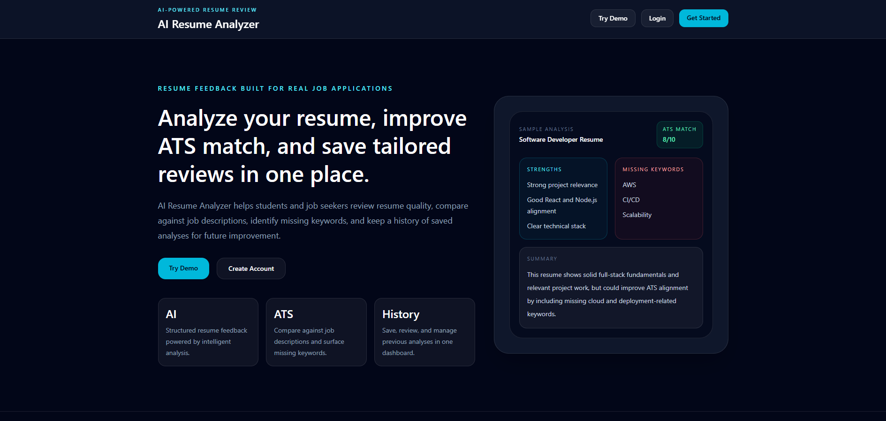
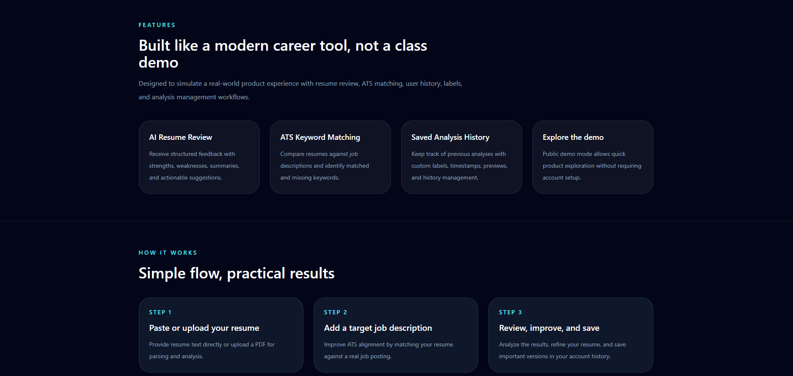
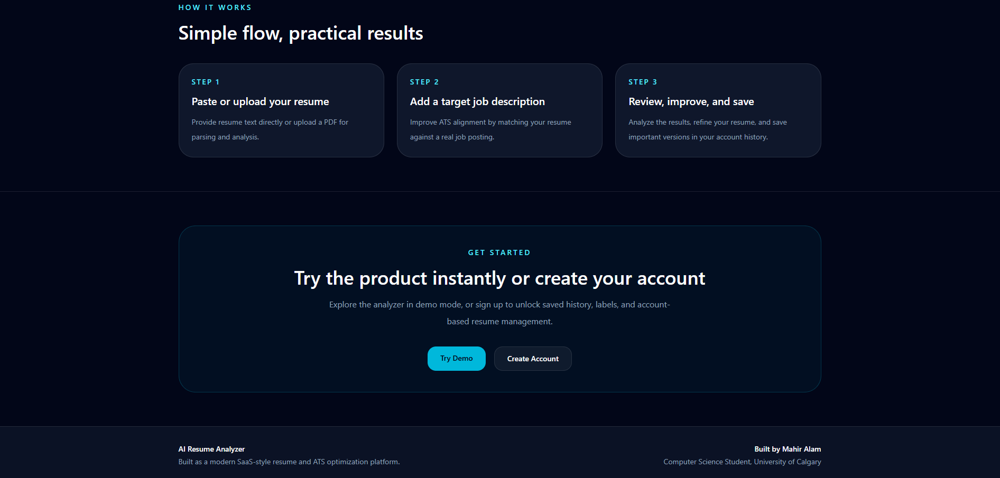
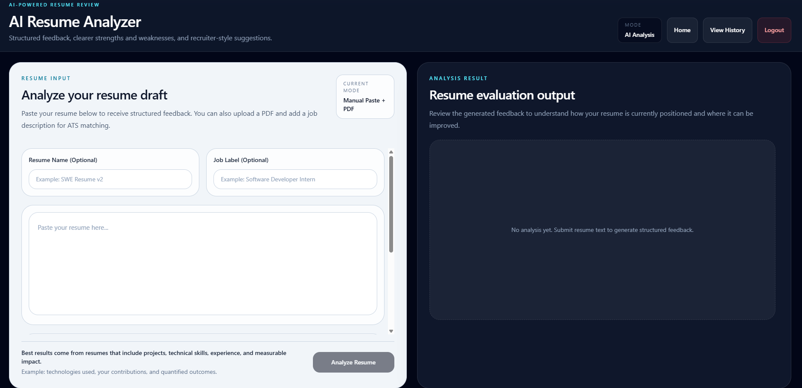
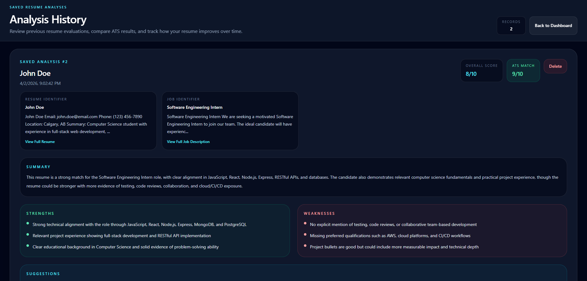
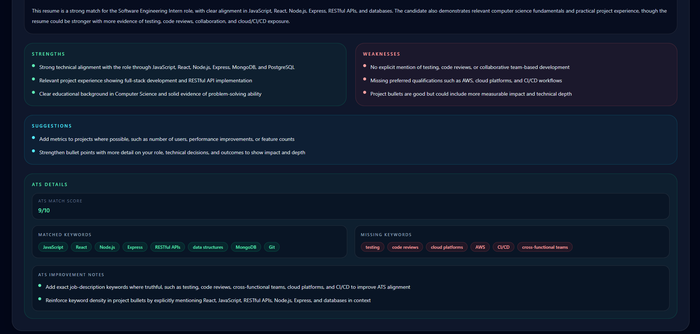

# 🚀 AI Resume Analyzer

AI-powered web application that analyzes resumes and provides ATS-style feedback, keyword matching, and improvement suggestions.

---

## ✨ Features

- Analyze resume (paste text or upload PDF)
- ATS-style scoring and feedback
- Keyword match & missing keyword detection
- AI-generated improvement suggestions
- User authentication (JWT)
- Save, view, and delete past analyses
- Demo mode (no login required)

---

## 🏗️ Tech Stack

- **Frontend:** React (Vite), Tailwind CSS
- **Backend:** Node.js, Express
- **Database:** MongoDB Atlas
- **AI:** OpenAI API
- **Deployment:** Vercel (frontend), Render (backend)

---

## 📸 Screenshots

### 🚀 Landing Experience

<p align="center">
  
  
</p>

<p align="center">
  
</p>

### 🧠 Resume Analyzer

<p align="center">
  
</p>

### 📊 Results & Insights

<p align="center">
  
</p>

### 📌 Detailed Feedback

<p align="center">
  
  
</p>

### Backend

```bash
cd server
npm install
npm run dev
```

### Frontend

```bash
cd client
npm install
npm run dev
```

---

## 🔐 Environment Variables

Create a `.env` file in **server**:

```env
MONGODB_URI=your_mongodb_connection
JWT_SECRET=your_secret_key
OPENAI_API_KEY=your_openai_api_key
CLIENT_URL=http://localhost:5173
```

Create a `.env` file in **client**:

```env
VITE_API_BASE_URL=http://localhost:8000
```

---

## 🧠 How It Works

```text
React Frontend → Express API → MongoDB + OpenAI API
```

- Frontend sends resume data
- Backend processes request
- OpenAI generates structured feedback
- Results can be saved to database

---

## 📌 Notes

- First request may be slow (Render free tier)
- Demo mode does not save data
- Requires OpenAI API key for analysis

---

## 👨‍💻 Author

Sarthak Patel

---

⭐ Star the repo if you found it useful!
